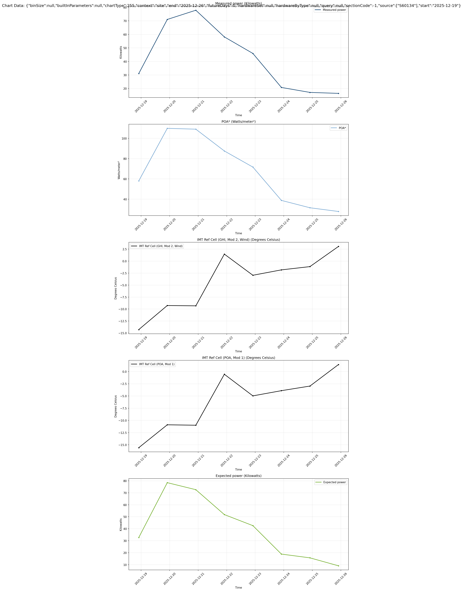

# Examples for PowerTrack SDK

## Table of Contents
- [Environment Variables](#environment-variables)
- [Usage Examples](#usage-examples)
- [Mocking](#mocking)
- [Backups](#backups)
- [Individual Method Examples](#individual-method-examples)
- [SDK Output Examples](#sdk-output-examples)
  - [Alert Summary](#alert-summary)
  - [Site Config](#site-config)
  - [Alert Triggers](#alert-triggers)
  - [Site Data](#site-data)
  - [Hardware List](#hardware-list)
  - [Hardware Details](#hardware-details)
  - [Hardware Diagnostics](#hardware-diagnostics)
  - [Driver Settings](#driver-settings)
  - [Register Offsets](#register-offsets)
  - [Modeling Data](#modeling-data)
  - [PV Model Curves](#pv-model-curves)
  - [PVSyst Modules](#pvsyst-modules)
  - [Portfolio Overview](#portfolio-overview)
  - [Site Overview](#site-overview)
  - [Site Detailed Info](#site-detailed-info)
  - [Site Hardware Production](#site-hardware-production)
  - [Chart Data](#chart-data)

## Environment Variables
- Environment variables (for real API): `COOKIE`, `AE_S`, `AE_V`, `BASE_URL`

## Usage Examples
- Fetch data for all sites in a SiteList:
  - `python examples/fetch_all_site_data.py --site-list portfolio/SiteList.json --output-dir portfolio/site_data/`

- Fetch site configs:
  - `python examples/fetch_site_configs.py --site-id S12345 --output-dir portfolio/configs/`

- Dry-run config update:
  - `python examples/update_site_config.py --site-id S12345 --update-file edits.json`

- Apply config update:
  - `python examples/update_site_config.py --site-id S12345 --update-file edits.json --apply`

- Dry-run hardware modeling update:
  - `python examples/update_inverter_modeling.py --hardware-id H12345 --mock`

- Apply hardware modeling update:
  - `python examples/update_inverter_modeling.py --hardware-id H12345 --update-file modeling_updates.json --apply`

- Fetch alert summaries (mock):
  - `python examples/fetch_all_site_alerts.py --customer-id C12345 --mock`

- All examples are importable and accept an optional `argv` list via `main(argv)` for testing.

## Mocking
- Use `--mock` on scripts to run without network. The mock client is a deterministic local implementation.

## Backups
- Update scripts save backups to `portfolio/config_backups/` by default when `--apply` is used. **Saving backups in your own scripts is highly encouraged** 

## Individual Method Examples

This directory contains individual CLI scripts for each SDK method, allowing you to test and explore every API endpoint supported by the SDK. All scripts support `--mock` for testing without API credentials.

### Portfolio & Overview
- `python3 examples/get_portfolio_overview.py --customer-id C1234 --mock`
- `python3 examples/get_site_overview.py --site-id S12345 --mock`
- `python3 examples/get_site_detailed_info.py --site-id S12345 --mock`

### Chart & Visualization
**Note:** The charting capabilities of PowerTrack are extensive. As of 26/12/2025 these endpoints and options have not been fully documented (by the author) and thus are not included in the SDK. Feel free to contribute!  
- `python3 examples/get_chart_data.py --site-id S60134`
- `python3 examples/get_chart_definitions.py --mock` (real API endpoint not available) (chart definitions endpoint not available in current API)

### Hardware Methods
- `python3 examples/get_hardware_list.py --site-id S12345 --mock`
- `python3 examples/get_hardware_details.py --hardware-id H12345 --mock`
- `python3 examples/get_hardware_diagnostics.py --hardware-id H12345 --mock`
- `python3 examples/get_site_hardware_production.py --site-id S12345 --mock`
- `python3 examples/get_register_offsets.py --hardware-id H12345 --mock`

### Alert Methods
- `python3 examples/get_alert_triggers.py --hardware-id H12345 --mock`
- `python3 examples/get_alert_summary.py --customer-id C1234 --mock`

### Modeling & Configuration
- `python3 examples/get_modeling_data.py --site-id S12345 --mock`
- `python3 examples/update_inverter_modeling.py --hardware-id H12345 --mock` (update hardware modeling)
- `python3 examples/get_pv_model_curves.py --model-type incidenceanglemodels`
- `python3 examples/get_pvsyst_modules.py --hardware-id H327293`
- `python3 examples/get_driver_settings.py --hardware-id H327293`
- `python3 examples/get_driver_list.py --code 1`

### Function Codes Reference

| Code | Hardware Type |
|------|---------------|
| 1 | Inverter (PV) |
| 2 | Production Meter (PM) |
| 3 | Type 3 |
| 4 | Grid Meter (GM) |
| 5 | Weather Station (WS) |
| 6 | DC Combiner |
| 9 | Kiosk |
| 10 | Gateway (GW) |
| 11 | Cell Modem (CE) |
| 14 | Camera |
| 20 | Extra Meter |
| 21 | DNP3 Server |
| 24 | Tracker |
| 25 | BESS Controller |
| 28 | Data Logger |
| 31 | Data Capture |
| 34 | Relay |
| 37 | BESS Meter |

### Site Management
- `python3 examples/get_site_config.py --site-id S12345 --mock`
- `python3 examples/fetch_site_list.py --customer-id C1234`

### Comprehensive Overview
- `python3 examples/get_site_data.py --site-id S12345 --mock`

## SDK Output Examples

### Portfolio  
`client.get_portfolio_overview(customer_id)` returns a list of sites in your portfolio. Try it with [fetch_site_list](https://github.com/dsd-hamsa/powertrack-sdk/blob/main/examples/fetch_site_list.py)
```
➜ python3 examples/fetch_site_list.py --customer-id C1234
[i] Customer ID: C1234
[i] Output file: portfolio/SiteList.json
[i] Fetching site list for customer: C1234
DEBUG: Found fetch file at: powertrack_sdk/mostRecentFetch.js
2025-12-26 15:29:23,247 - INFO - Initialized PowerTrack client for https://apps.alsoenergy.com
[i] Found 123 sites in portfolio
[✓] Site list saved to: portfolio/SiteList.json
[i] Contains 123 sites

[✓] Site list fetching complete!
[i] Use this file with SDK methods like:
    site_list = SiteList.from_json_file('portfolio/SiteList.json')
```

### Alert Summary
`client.get_alert_summary(customer_id)` returns an `AlertSummaryResponse` with hardware-level summaries:

```json
{
  "hardware_summaries": {
    "H12345": {
      "hardware_key": "H12345",
      "count": 2,
      "max_severity": 4
    },
    "H67890": {
      "hardware_key": "H67890",
      "count": 1,
      "max_severity": 5
    }
  }
}
```

### Site Config
`client.get_site_config(site_id)` returns a `SiteConfig` object:

```json
{
  "siteId": "S12345",
  "name": "Example Site",
  "timezone": "UTC",
  "latitude": 40.7128,
  "longitude": -74.0060,
  "elevation": 10,
  "address": "123 Main St",
  "city": "New York",
  "state": "NY",
  "zipCode": "10001",
  "country": "USA",
  "installDate": "2020-01-01",
  "acCapacityKw": 100.0,
  "dcCapacityKw": 120.0,
  "moduleCount": 400,
  "rawData": { ... }
}
```

### Alert Triggers
`client.get_alert_triggers(hardware_key)` returns an `AlertTrigger` object:

```json
{
  "key": "H12345",
  "parentKey": "S12345",
  "assetCode": "H12345",
  "calculatedCapacity": 100.0,
  "capacity": 100.0,
  "lastChanged": "2023-01-01T00:00:00Z",
  ...
  "defaultTriggers": [ ... ]
}
```

[the new string]

### Hardware List
`client.get_hardware_list(site_id)` returns a list of hardware devices for the site.

```json
[
  {
    "key": "H12345",
    "name": "Cell Modem",
    "functionCode": 11,
    "hid": null,
    "shortName": null,
    "serialNum": "012-1363188",
    "mfrModel": null,
    "deviceId": null,
    "installDate": "2021-09-16",
    "deviceAddress": null,
    "port": null,
    "unitId": null,
    "baud": null,
    "gatewayId": null,
    "enableBool": true,
    "hardwareStatus": 1,
    "capacityKw": null,
    "inverterKw": 0.0,
    "driverName": null,
    "outOfService": false
  }
  // ... more items
]
```

### Hardware Details
`client.get_hardware_details(hardware_id)` returns detailed information about a hardware device.

```json
{
  "key": "H12345",
  "summary": {
    "key": "H12345",
    "name": "",
    "functionCode": 5,
    "hid": null,
    "shortName": null,
    "serialNum": null,
    "mfrModel": null,
    "deviceId": null,
    "installDate": null,
    "deviceAddress": null,
    "port": null,
    "unitId": null,
    "baud": null,
    "gatewayId": null,
    "enableBool": true,
    "hardwareStatus": null,
    "capacityKw": null,
    "inverterKw": null,
    "driverName": null,
    "outOfService": false
  },
  "details": {
    "key": "H12345",
    "parentKey": "S12345",
    "ts": "2023-08-24T16:29:21Z",
    "description": "Solcast Virtual Weather Station",
    "assetId": "",
    "hardwareId": "C12345_S12345_WS3",
    "instance": 3,
    "functionId": "WS3",
    "functionCode": 5,
    "hardwareStatus": 1,
    "capacityKw": 0.0,
    "sort": 0,
    "gatewayKey": "",
    "gatewayId": "",
    "gatewayFwVersion": "",
    "gatewayScriptCount": "",
    "gatewayType": 0,
    "serialNum": "",
    "modelNum": "",
    "installDate": "2023-08-25",
    "driverId": 19015,
    "driverDescription": "Weather data from external sources...",
    "driverFlags": 64,
    "driverName": "External Weather Source (full)",
    "driverNotes": "",
    // ... more fields
  }
}
```

### Hardware Diagnostics
`client.get_hardware_diagnostics(hardware_id)` returns diagnostic information for a hardware device.

```json
{
  "key": "H12345",
  "hardwareName": "Solcast Virtual Weather Station",
  "lastAttempt": "2025-12-26T21:57:51Z",
  "lastChanged": "2023-08-24T16:29:21Z",
  "lastCommunication": 0,
  "lastSuccess": "2025-12-26T21:55:00Z",
  "outOfService": false,
  "outOfServiceNote": "",
  "outOfServiceUntil": null,
  "parentKey": "S12345",
  "readOnly": false,
  "timeZone": "US/Central",
  "unitId": 0,
  "registerSets": [
    {
      "registers": [
        {
          "name": "Wind Direction",
          "localizedName": "Wind Direction",
          "standardDataName": "Wind_Direction",
          "legacyDataName": "WindDirection",
          "isStored": true,
          "address": "1",
          "value": "263",
          "units": "°",
          "register": "263",
          "scale": "",
          "identifier": "",
          "canModify": false,
          "hide": false,
          "standardAlertMessage": [],
          // ... more fields
        }
        // ... more registers
      ],
      "name": "Data",
      "brokenRegisters": []
    }
  ],
  // ... more fields
}
```

### Driver Settings
`client.get_driver_settings(hardware_id)` returns driver settings for a hardware device.

```json
{
  "key": "H12345",
  "lastChanged": "2024-10-29T02:24:22Z",
  "driverSettings": [
    {
      "name": "dev:Enable",
      "value": "0",
      "type": 1
    },
    {
      "name": "dev:KWHoffset",
      "value": "0",
      "type": 2
    }
    // ... more settings
  ]
}
```

### Register Offsets
`client.get_register_offsets(hardware_id)` returns register offset information for a hardware device.

```json
{
  "key": "H12345",
  "lastChanged": "2025-12-23T18:41:15Z",
  "registerOffsets": [
    {
      "index": 0,
      "registerAddress": 9000,
      "registerModbusName": "Active Energy Net Raw",
      "name": "",
      "value": 0.0
    },
    {
      "index": 1,
      "registerAddress": 30531,
      "registerModbusName": "Active Energy Net",
      "name": "KWHoffset",
      "value": 0.0
    }
  ]
}
```

### Modeling Data
`client.get_modeling_data(site_id)` returns modeling data for the site.

```json
{
  "siteId": "S12345",
  "pvConfig": {
    "pvModelType": 8,
    "acDcType": 0,
    "acInfo": 0,
    "inverters": [
      {
        "mppWatts": 0.0,
        "pvSystOutOfSync": false,
        "pvSystModuleId": 0,
        // ... more fields
        "azimuth": 180.0,
        "tilt": 0.0,
        "tracking": 0,
        "derate": 0.9,
        // ... more fields
      }
    ],
    // ... more config
  },
  "inverters": [ /* similar to pvConfig.inverters */ ],
  "ts": "2025-12-12T17:29:30Z",
  "rawData": { /* detailed data */ }
}
```

### PV Model Curves
`client.get_pv_model_curves(model_type)` returns PV model curves for a given model type.

```json
[
  {
    "name": "Select Inverter Efficiency Curve",
    "value": 0
  },
  {
    "name": "ABB, PVS980-58-1818kVA-I",
    "value": 818
  }
  // ... more curves
]
```

### PVSyst Modules
`client.get_pvsyst_modules(hardware_id, siteId)` returns PVSyst module data.

```json
[
  {
    "name": "(Custom PVsyst Configuration)",
    "value": 0
  },
  {
    "name": "?Jinko, JKM435M_78H",
    "value": 547
  }
  // ... more modules
]
```

### Portfolio Overview
`client.get_portfolio_overview(customer_id)` returns an overview of sites in the portfolio.

```json
{
  "customerId": "C12345",
  "sites": [
    {
      "key": "S12345",
      "name": "Customer Corporation",
      "availability": 100.0,
      "availabilityLoss": 0.0,
      "calculatedInverterAvailability": 100.0,
      "capacityDc": 2099.0,
      "chargeDischarge": null,
      "customColumnData": ["", "", "", "", "", ""],
      "downtimeLoss": 0.0,
      "energyAvailability": 100.0,
      "energyAvailabilityLoss": 0.0,
      "energyCapacity": null,
      "energyLoss": 1601.689606379281,
      "energyRatio": 67.91037547742938,
      "gridOffline": 0.0,
      "ground": 5,
      "id": 34924,
      "insolation": 1.0318963499999996,
      "inverterCount": 2,
      "inverterFaults": 0,
      "irradiance": 243.4575958251953,
      "kioskStatus": -1,
      "kiosks": 0,
      "kwPercent": 79.46173608628946,
      "kwhPercent": 67.91037547742938,
      "lastDataUTC": "2025-12-26T19:07:10Z",
      "lastMonth": 4684000.0,
      "lastUpload": "2025-12-26T19:14:53Z",
      "lastYear": 4800668.0,
      "lifetime": 25736912.0,
      "message": "",
      "monitoredSiteType": 0,
      "parentKey": "S12345",
      "paymentStatus": 3145728,
      "performanceIndex": 0.6254714131355286,
      "performanceTestDelta": 61.962615966796875,
      "performanceTestStatus": 2,
      "performanceTestValue": 61.962615966796875,
      "power": 140.97000122070312,
      "power24": 1900.0,
      "power24Est": 2797.80517578125,
      "powerAvg15": 300.68701171875,
      "powerAvg15Exp": 378.40478515625,
      "pvCapacityAc": 1760.0,
      "pvCapacityDc": 2099.0,
      "ratedPower": null,
      "availableEnergy": null,
      "reminderColor": "rgba(211,211,211,1)",
      "revenueLoss": 286.57430564119784,
      "rolling24Kw": [],
      "rolling24KwIdx": 0,
      "ruleToolSummary": {
        "timestamp": "2025-12-26T10:31:02Z",
        "communication": 0,
        "configuration": 2,
        "data": 0,
        "performance": 0,
        "message": "12/26/2025 10:31:02 AM"
      },
      "sizeDC": 2099.0,
      "sizeKW": 1760.0,
      "soilingLoss": 0.0,
      "stateOfCharge": null,
      "status": 8,
      "alertSeverity": null,
      "alertName": "",
      "systemSize": 1760.0,
      "thisMonth": 70594.0,
      "thisYear": 2335154.0,
      "timeZone": "US/Eastern",
      "today": 1056.0,
      "todayEstimated": 4276.54833984375,
      "todayPercent": 24.69281102616,
      "type": 0,
      "todayAnd7DayAverageKw": {
        // ... data
      },
      "estimatedCommissioningDate": "2015-09-11T00:00:00Z",
      "expirationDate": "2030-08-30T00:00:00"
    }
    // ... more sites
  ]
}
```

### Site Overview
`client.get_site_overview(site_id)` returns an overview of a specific site.

```json
{
  "key": "S12345",
  "name": "Customer Corporation",
  "availability": "NaN",
  "availabilityLoss": "NaN",
  "calculatedInverterAvailability": 0.0,
  "capacityDc": 0.0,
  "chargeDischarge": null,
  "customColumnData": ["", "", "", "", "", ""],
  "downtimeLoss": "NaN",
  "energyAvailability": 0.0,
  "energyAvailabilityLoss": 0.0,
  "energyCapacity": null,
  "energyLoss": "NaN",
  "energyRatio": "NaN",
  "gridOffline": 0.0,
  "ground": 5,
  "id": 70726,
  "insolation": "NaN",
  "inverterCount": 4,
  "inverterFaults": 0,
  "irradiance": 1226.1199951171875,
  "kioskStatus": -1,
  "kiosks": 0,
  "kwPercent": "NaN",
  "kwhPercent": "NaN",
  "lastDataUTC": null,
  "lastMonth": 0.0,
  "lastUpload": "2025-12-26T19:35:04Z",
  "lastYear": 0.0,
  "lifetime": 0.0,
  "message": "System size not set\r\nPR calculation failed (Standard)",
  "monitoredSiteType": 0,
  "parentKey": "S12345",
  "paymentStatus": 0,
  "performanceIndex": "NaN",
  "performanceTestDelta": 0.0,
  "performanceTestStatus": 3,
  "performanceTestValue": 0.0,
  "power": 0.0,
  "power24": "NaN",
  "power24Est": "NaN",
  "powerAvg15": "NaN",
  "powerAvg15Exp": "NaN",
  "pvCapacityAc": 0.0,
  "pvCapacityDc": 0.0,
  "ratedPower": null,
  "availableEnergy": null,
  "reminderColor": "rgba(211,211,211,1)",
  "revenueLoss": "NaN",
  "rolling24Kw": [],
  "rolling24KwIdx": 0,
  "ruleToolSummary": {
    "timestamp": null,
    "communication": -1,
    "configuration": -1,
    "data": -1,
    "performance": -1,
    "message": ""
  },
  "sizeDC": 0.0,
  "sizeKW": 0.0,
  "soilingLoss": "NaN",
  "stateOfCharge": null,
  "status": 2,
  "alertSeverity": null,
  "alertName": "",
  "systemSize": 0.0,
  "thisMonth": 0.0,
  "thisYear": 0.0,
  "timeZone": "US/Eastern",
  "today": "NaN",
  "todayEstimated": "NaN",
  "todayPercent": "NaN",
  "type": 0,
  "todayAnd7DayAverageKw": {
    "plotActual": [],
    "plotAverage": [],
    "plotIdx": -1,
    "solarNoon": "0001-01-01T00:00:00"
  },
  "estimatedCommissioningDate": null,
  "expirationDate": "2030-04-19T00:00:00"
}
```

### Site Detailed Info
`client.get_site_detailed_info(site_id)` returns detailed information about a site.

```json
{
  "key": "S12345",
  "name": "Customer Corporation",
  "isMonitored": true,
  "cellModemContractEndDate": "2030-04-19T00:00:00Z",
  "address": {
    "address1": "1234 S 45th Ave",
    "address2": "",
    "city": "Anyplace",
    "country": "",
    "stateProvince": "NY",
    "postalCode": "12345"
  },
  "cellModemContractStartDate": "2025-04-19T00:00:00Z",
  "energyCapacityUnit": 11,
  "longitude": -87.863765,
  "parentKey": "C12345",
  "weatherMode": 0,
  "monitoringContractIsManual": false,
  "cellModemContractCustomBanner": false,
  "monitoringContractWarnDate": "2030-02-18T00:00:00Z",
  "workingStatus": "Awaiting Site Commissioning",
  "capacityDcUnit": 10,
  "elevation": 0,
  "dailyProductionEstimate": 391.49813594376366,
  "lastChanged": "2025-12-16T16:46:22Z",
  "monthlyProductionEstimate": 11627.252189026518,
  "ratedPowerUnit": 10,
  "monitoringContractCustomBanner": false,
  "monitoringContractStatus": 0,
  "monitoringContractEndDate": "2030-04-19T00:00:00Z",
  "estimatedCommissioningDate": null,
  "cellModemContractAccessNote": "",
  "cellModemContractTerminateDate": "2031-04-19T00:00:00Z",
  "cellModemContractIsManual": false,
  "customerLogo": "/Content/DBFile?urltype=file&fidrev=F86940",
  "capacityAc": 0.0,
  "customQueryKey": "",
  "preferredWsForEstimatedInsolation": 0,
  "requiresPubIp": false,
  "defaultQuery": 15,
  "monitoringContractWillNotRenew": false,
  "capacityAcUnit": 10,
  "status": 2,
  "latitude": 41.8467803,
  "ratedPower": 0.0,
  "advancedSiteConfiguration": false,
  "monitoringContractTerminateDate": "2031-04-19T00:00:00Z",
  "actualCommissioningDate": null,
  "estimatedLosses": {
    "clipping": "0",
    "downtime": "0",
    "irradiance": "0",
    "shading": "0",
    "snow": "0",
    "soiling": "0",
    "temperature": "0"
  },
  "cellModemContractWarnDate": "2030-02-18T00:00:00Z",
  "monitoringContractAccessNote": "",
  "validDataDate": "2025-01-16T00:00:00Z",
  "paymentStatus": 0,
  "capacityDc": 0.0,
  "monitoringContractStartDate": "2025-04-19T00:00:00Z",
  "energyCapacity": 0.0,
  "overviewChart1": "255",
  "overviewChart2": "0",
  "cellModemContractWillNotRenew": false,
  "siteType": 0,
  "sitePhotos": null
}
```

### Site Hardware Production
`client.get_site_hardware_production(site_id)` returns production data for hardware at the site.

```json
[
  {
    "key": "H12345",
    "name": "Cell Modem (Microhard Bullet)",
    "description": "Cell Modem (Microhard Bullet)",
    "hardwareStatus": 1,
    "serialNum": "012-1363188",
    "installDate": "2021-09-16",
    "lastChanged": "2024-11-15T02:23:35Z",
    "communicationResult": 0,
    "lastAttempt": "2025-12-26T22:04:26Z",
    "lastSuccess": "2025-12-26T22:04:19Z",
    "lastData": "",
    "primaryMetricName": 0,
    "primaryMetric": "",
    "inverterKw": 0.0,
    "dataRegisters": [],
    "deviceImage": {
      "uri": "https://www.alsoenergy.com/pub/Images/Device/7873.png",
      "key": "",
      "name": "DA_V7873",
      "lastChanged": null,
      "contentType": ""
    },
    "functionCode": 11,
    "defaultChart": 0,
    "outOfService": false,
    "capacityKW": null,
    "sortOrder": 1,
    "units": 0,
    "unitsScale": "NaN"
  }
  // ... more hardware
]
```

### Chart Data
`client.get_chart_data(chart_type, site_id, start_date, end_date, bin_size)` returns chart data for visualization.

```json
{
  "allow_small_bin_size": true,
  "bin_size": 1440,
  "current_now_bin_index": 7,
  "data_not_available": false,
  "durations": [
    {
      "id": "day",
      "days": 1,
      "binSize": 1440
    }
    // ... more durations
  ],
  "end": "2025-12-26T23:59:59",
  "error_string": "",
  "hardware_keys": ["BAD", "H12345", "H12345", "H67890", "H54321"],
  "has_alert_messages": false,
  "has_overridden_query": false,
  "is_category_chart": false,
  "is_summary_chart": false,
  "is_using_daylight_savings": true,
  "key": "{\"binSize\":null,\"builtInParameters\":null,\"chartType\":255,\"context\":\"site\",\"end\":\"2025-12-26\",\"futureDays\":0,\"hardwareSet\":null,\"hardwareByType\":null,\"query\":null,\"sectionCode\":-1,\"source\":[\"S12345\"],\"start\":\"2025-12-19\"}",
  "last_changed": "2025-12-26T20:24:51Z",
  "last_data_datetime": "2025-12-26T06:00:00Z",
  "named_results": {
    "average": 42.289224999999995
  },
  "render_type": 0,
  "series": [
    {
      "name": "Measured power",
      "key": "sum",
      "dataXy": [
        [1766124000000.0, 31.04916],
        [1766210400000.0, 71.04673]
        // ... more data points
      ],
      "color": "#154672",
      "custom_unit": "Kilowatts",
      "data_max": 77.86376,
      "data_min": 16.39529,
      "diameter": 0,
      "fit_exponent": 0,
      "header": "Measured power",
      "line_color": "#154672",
      "line_type": 0,
      "line_width": 2.0,
      "right_axis": false,
      "units": 10,
      "use_binned_data": false,
      "visible": true,
      // ... more fields
    }
    // ... more series
  ],
  "summaryTable": [
    ["Average", "42.289224999999995"]
  ],
  "start": "2025-12-19T00:00:00"
}
```
The `--render` argument can be used (with or without the `--render-file` arg) to generate a chart of the data.

